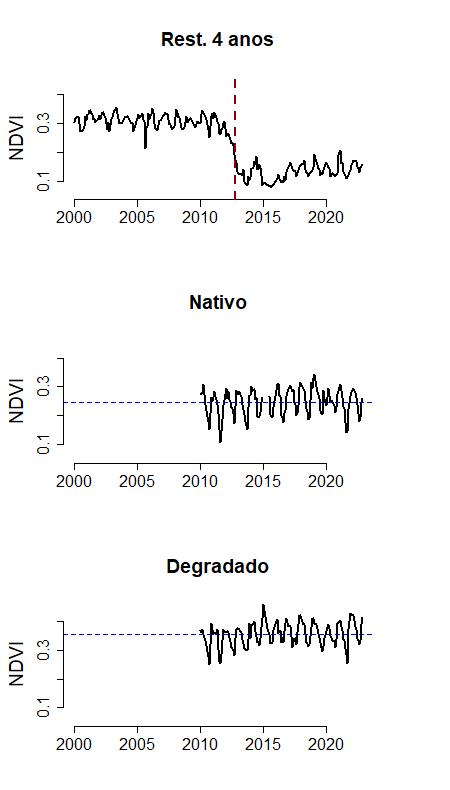

```{r setup, include=FALSE}
knitr::opts_chunk$set(echo = TRUE, warning = FALSE)
```

```{r set-options, echo=FALSE, cache=FALSE}
```

# Sensoriamento remoto para restauração

Paulo N Bernardino ([paulo.nbernardino\@gmail.com](mailto:paulo.nbernardino@gmail.com){.email})

[Division Forest, Nature and Landscape, KU Leuven](https://ees.kuleuven.be/fnl/staff/index.html?intranet=u0115271)

[Laboratório de Ecologia Funcional das Plantas, UNICAMP](https://www.ib.unicamp.br/lab_ecologia_vegetal/front_page)

## Parte 1: Processando imagens de Landsat

Defina a sua área de trabalho do R para o local onde este arquivo está salvo.


Use o código abaixo para instalar e carregar os pacotes necessários.

```{r, echo=TRUE, message=FALSE, eval=TRUE}
# pkgTest is a helper function to load packages and install packages only when they are not installed yet.
pkgTest <- function(x)
{
  if (x %in% rownames(installed.packages()) == FALSE) {
    install.packages(x, dependencies= TRUE)
  }
  library(x, character.only = TRUE)
}
neededPackages <- c("raster", "rgdal", "gimms")
for (package in neededPackages){pkgTest(package)}
```

O primeiro passo é carregar as imagens de satélite do Landsat no R. Para a primeira parte do exercício, precisaremos apenas de duas imagens: a imagem contendo o NDVI para Dezembro de 2000 (LE07_221076_20001210.tif), e sua respectiva máscara (LE07_mask_20001210.tif).

Use o código abaixo para carregar os dados no seu ambiente de trabalho no R.

```{r, echo=TRUE, message=FALSE}
## Create objects containing the path to your files
files_ndvi <- "data/LE07_221076_20001210.tif"
files_mask <- "data/LE07_mask_20001210.tif"

## Use the files lists to load the data as raster stacks
ndvi <- stack(files_ndvi)
mask <- stack(files_mask)
```

Vamos visualizar as imagens carregadas:

```{r, echo=TRUE, message=FALSE}
plot(ndvi)
plot(mask)
```

A máscara fornecida pelo próprio produto do Landsat separa a imagem em algumas classes: corpos d'água, estradas, vegetação e nuvens. Para esse exercício, estamos interessados em analisar a vegetação, portanto, todas as outras classes devem ser removidas da nossa imagem. Porém, no exemplo a seguir, removeremos apenas as nuvens. No exercício no final dessa prática, vocês deverão remover os corpos d'água e as estradas. 

Repare que as cores estão diferentes nos mapas da máscara (acima e abaixo), porém os valores relacionadas a cada classe são os mesmos.


Para aplicar a máscara que removerá as nuvens da imagem, use o código abaixo:

```{r, echo=TRUE, message=FALSE}
## Transform the desired values in NAs, then use the mask function
mask[mask==4] <- NA # "clouds" class
ndvi <- mask(ndvi, mask)
plot(ndvi)
```

Em seguida, vamos restringir a imagem apenas para a nossa área de interesse, restringindo a quantidade de dados que serão analisados e diminuindo o tempo de processamento. Por último, dividimos os valores no raster por 10000, que é o fator de escala para esse produto de NDVI. Os dados são armazenados como números inteiros (isto é, os valores de NDVI são multiplicados por 10000 antes de serem armazenados) porque dessa maneira ocupam menos espaço no computador. Porém, como sabemos, os valores de NDVI devem variar de 0 a 1.

```{r, echo=TRUE, message=FALSE}
## Load the reserve borders
reserve <- readOGR("data/ASB_limites_expandido.shp")

## Crop to the study area extent
ndvi <- crop(ndvi, reserve)

## Mask areas outside the reserve
ndvi <- mask(ndvi, reserve)

## Rescale NDVI values
ndvi <- ndvi/10000

## Visualize the output
plot(ndvi)
```

Este é um exemplo de como processar as imagens de Landsat. O mesmo processo deve ser repetido em todas as imagens (uma por mês) que serão usadas em sua análise. Para agilizar, as imagens já foram pré-processadas e estão prontas para análise. As imagens processadas, para o período de Janeiro de 2000 a Dezembro de 2022, estão salvas no arquivo "NDVI_ASB_2000-2022.tif".

## Parte 2: Analisando a trajetória da restauração

Nesta segunda parte, vamos analisar como uma parcela que sofreu uma intervenção de restauração está evoluindo. A intervenção consistiu em remover as árvores da área degradada (que consistia de uma monocultura de uma espécies invasora), efetuar queimada controlada, e então transplantar blocos de vegetação provenientes de uma área de vegetação nativa nas proximidades. Esta intervenção foi realizada 4 anos atrás.

Para avaliar a evolução da área sendo restaurada, usaremos o NDVI da mesma, que será comparado com o NDVI de uma área de vegetação nativa (ecossistema de referência) e de uma área ainda degradada. Usaremos as imagens de Landsat já processadas salvas no arquivo "NDVI_ASB_2000-2022.tif".

Na imagem abaixo, a área sendo restaurada está representada em rosa, a área de vegetação nativa em azul, e a área degradada em cinza.


```{r, echo=TRUE, message=FALSE}
## Load the pre-processed NDVI data and the plots to be analyzed
ndvi_prepro <- brick("data/NDVI_ASB_2000-2022.tif")
sites <- readOGR("data/sitios.shp")

## Rescale NDVI values
ndvi_prepro <- ndvi_prepro/10000

## Visualize the plots to be analyzed
ndvi_jan2000 <- ndvi_prepro[[1]]  # [[1]] indicate the first image in the time series of images
plot(ndvi_jan2000)
plot(sites[2,], add=T, col="magenta")
plot(sites[4,], add=T, col="blue")
plot(sites[5,], add=T, col="darkgray")

```

O polígono "sites" também contém outras parcelas, que serão usadas no exercício no final desta aula prática. Para visualizar a classe de cada parcela, basta usar o código abaixo:

```{r, echo=TRUE, message=FALSE}
## Check the classes of each plot
data.frame(id = 1:5, classe = sites$tratamento)

```

Primeiramente, vamos avaliar as séries temporais das áreas de interesse.

(1) Para a área sendo restaurada, olharemos para a série temporal completa, de Jan 2000 a Dez 2022. Dessa maneira, podemos observar o momento em que a intervenção se iniciou: os altos valores de NDVI, representando uma "floresta", de repente caem para valores mais baixos, quando há o corte e a queima. Em seguida, observamos um lento aumento no NDVI, conforme a vegetação nativa se regenera.

(2) Como não temos dados sobre a área que está sendo restaurada antes de ela ser degradada, o que poderia ser usado como o "estado de referência" para a restauração, utilizamos dados de uma área próxima com vegetação nativa. Não importa muito saber como essa área era no passado, portanto olhamos para a série temporal apenas entre 2010 e 2022.

(3) Por último, para saber como é o NDVI de uma área ainda degradada, completamente coberta por uma espécie de árvore exótica, olhamos para a série temporal dessa área, também no período mais recente. Repare que, na média, o NDVI dessa área é bem mais alto (0.35) do que o NDVI da área nativa (0.25). Isso se dá pois, geralmente, áreas florestais apresentam um NDVI mais alto do que áreas de campo e savana.



Portanto, para avaliar o estado da restauração, podemos usar esses valores de referência. Por exemplo, quando a área que está sendo restaurada chegar à valores próximos de 0.25, saberemos que ela está mais próxima do estado conservado (nosso sistema de referência).

Vamos então checar como está o NDVI no último ano da nossa série temporal, 2022.


```{r echo=TRUE, message=FALSE}
## Calculate the mean NDVI for 2022
ndvi_mean_2022 <- mean(ndvi_prepro[[265:276]], na.rm = T)

## Extract the values from the restoration site
values_restoration <- unlist(extract(ndvi_mean_2022, sites[2,]))

## Also extract values for the conserved and degraded areas
values_conserved <- unlist(extract(ndvi_mean_2022, sites[4,]))
values_degraded <- unlist(extract(ndvi_mean_2022, sites[5,]))

## Give names to the classes
class1 <- rep("Rest. 4 anos", length(values_restoration))
class2 <- rep("Nativo", length(values_conserved))
class3 <- rep("Degradado", length(values_degraded))

## Put all the data into a data frame
df <- data.frame(ndvi = c(values_restoration, values_conserved, values_degraded), class = c(class1, class2, class3))
df$class <- factor(df$class, levels = c("Rest. 4 anos", "Nativo", "Degradado"))

## Plot
boxplot(df$ndvi ~ df$class, xlab =" ", ylab = "NDVI", boxwex = 0.6, frame = F, cex.axis=1.4, cex.lab=1.5)
```

# Exercício

O objetivo desse exercício é avaliar como outras áreas que estão sendo restauradas estão evoluindo. Isto é, qual delas está mais próxima do estado de referência. Você pode utilizar os dados que já estão carregados no seu ambiente de trabalho no R:

-   "ndvi_mean_2022", que contém os valores de NDVI médio para o ano de 2022
-   "sites", que contém as 5 parcelas de estudo
-   "reserve", que contém os limites da reserva
-   "mask", que contém a máscara que será utilizada para excluir áreas sem vegetação

As tarefas que devem ser realizadas são as seguintes:

(1) Processe a imagem "ndvi_mean_2022", (a) retirando áreas com corpos d'água e estradas, (b) recortando a imagem para a área da reserva, e (c) mascarando áreas fora da reserva. Não é necessário mudar a escala dos dados de NDVI, eles já estão na escala correta. Também não é necessário mascarar nuvens, já que estas imagens não apresentaram nenhuma.

(2) Extraia os dados de NDVI para as parcelas que ainda não foram analisadas: restauração com 7 anos e regenreação natural.

(3) Visualize o NDVI de cada parcela e determine qual delas está mais próxima do sistema de referência.

(4) Usando os dados extraídos, calcule o NDVI médio do sistema de referência (área nativa). Use este valor para saber, em toda a reserva, quais áreas estão mais próximas ou mais distantes desse valor de referência.


Dica:
```{r echo=TRUE, message=FALSE}
# ndvi_mean_2022 - valor
```

Se você subtrair ou adicionar um número ao raster, esse número será subtraído adicionada a cada célula desse raster.
